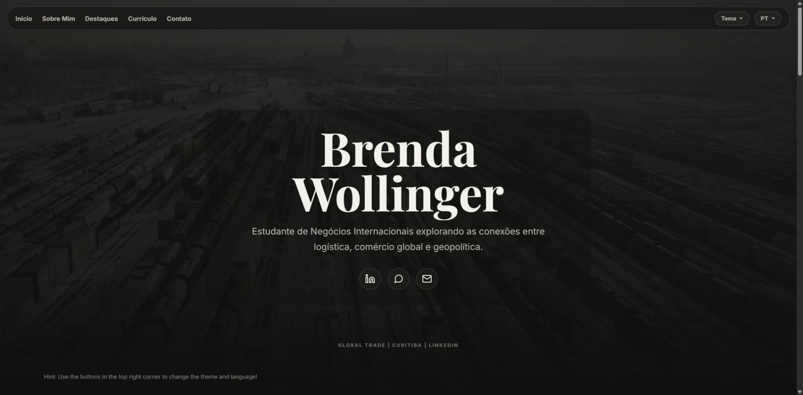
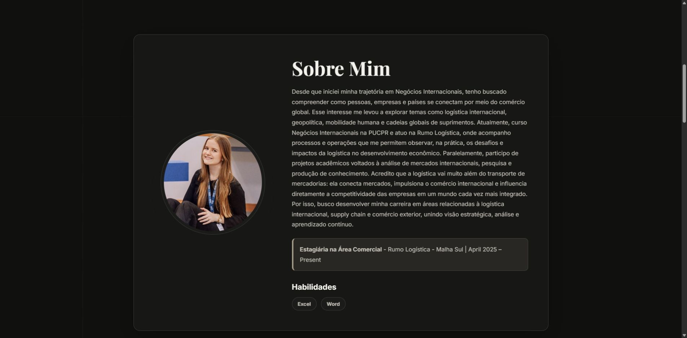
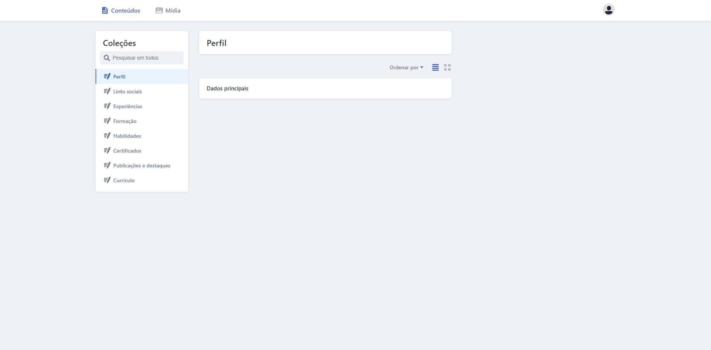

# Portfolio Brenda Wollinger

Portfólio profissional desenvolvido em React para apresentar a trajetória e os trabalhos de Brenda Wollinger. O conteúdo principal é organizado em arquivos JSON e pode ser atualizado pela proprietária por meio de uma interface administrativa, sem editar diretamente o código.

## Visão geral

O site reúne perfil profissional, experiências, habilidades, publicações e destaques, além de uma área para visualizar e baixar o currículo. Formação e certificados também possuem arquivos de conteúdo e campos de edição no painel administrativo. A integração com o Decap CMS é o principal recurso de gestão do projeto.

## Principais funcionalidades

- Interface responsiva em React, com versões em português e inglês.
- Alternância entre temas claro e escuro, com preferência salva no navegador.
- Painel Decap CMS em `/admin` para editar perfil, links sociais, experiências, formação, habilidades, certificados, publicações e currículo.
- Upload de imagens e arquivos pelo painel, com mídia armazenada em `public/uploads/`.
- Conteúdo estruturado em JSON e backend GitHub configurado para o CMS.
- Formulário de contato integrado ao EmailJS.
- Visualização e download do currículo em PDF.

## Screenshots

**Página inicial**



**Conteúdo do portfólio**



**Painel administrativo**



## Arquitetura de conteúdo

Os dados editáveis ficam em `src/content/`, separados por assunto. A configuração em `public/admin/config.yml` associa esses arquivos às coleções do Decap CMS. Ao salvar alterações pela interface administrativa, o backend GitHub configurado no CMS persiste o conteúdo no repositório. Os arquivos enviados pelo painel usam `public/uploads/`.

## Tecnologias

- React e Vite
- CSS
- i18next e react-i18next
- Decap CMS
- GitHub, como backend do CMS
- Vercel, indicada na configuração de autenticação do CMS e pelos endpoints em `api/`
- EmailJS, usado no formulário de contato

## Painel administrativo

Acesse `/admin` para gerenciar os conteúdos definidos nas coleções do Decap CMS. O painel usa autenticação GitHub configurada por endpoints em `api/`; o acesso depende das permissões do repositório e da configuração do ambiente de implantação.

## Estrutura do projeto

```text
api/                 Endpoints de autenticação do CMS
public/admin/        Interface e configuração do Decap CMS
public/uploads/      Mídia enviada pelo painel
src/components/      Componentes e seções da interface
src/content/         Conteúdo estruturado em JSON
src/locales/         Traduções em português e inglês
```

## Execução local

```bash
npm install
npm run dev
```

## Build

```bash
npm run build
```

## Contexto do projeto

O projeto foi criado para uma usuária real. Uma das metas é permitir que ela atualize o conteúdo do portfólio com autonomia, sem precisar conhecer React ou editar arquivos de código.

## Melhorias futuras

- Integrar formação e certificados às seções públicas do site, caso essas informações devam ser exibidas aos visitantes.
- Revisar os arquivos de currículo de exemplo presentes no projeto antes da publicação final.
